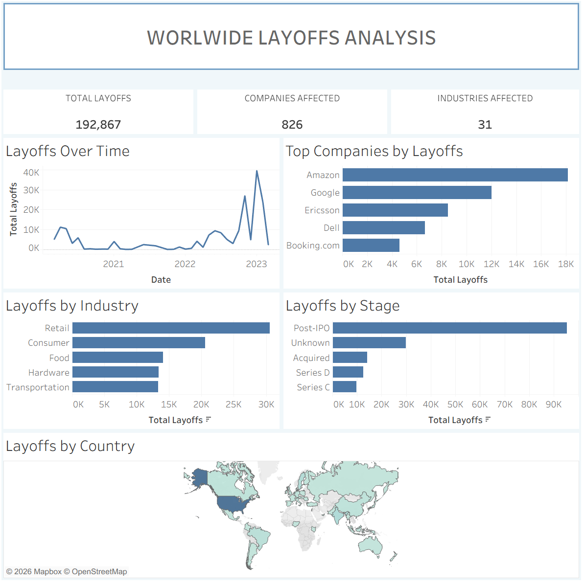

# Worldwide Layoffs Data Analysis

## Project Overview

In this project, I used MySQL to clean and analyze a worldwide layoffs dataset. The goal was to prepare raw data for analysis and identify trends across companies, industries, countries, and time periods.

## Tools Used

- MySQL
- MySQL Workbench
- Tableau

## Data Cleaning

- Created staging tables to preserve the original dataset
- Removed duplicates using `ROW_NUMBER()`
- Standardized company, industry, and country values
- Converted dates to the appropriate format
- Handled NULL and blank values
- Used a self-join to populate missing industry data

## Exploratory Data Analysis

- Analyzed layoffs by company, industry, country, year, and company stage
- Identified companies that laid off 100% of their workforce
- Examined full-company layoffs based on funding raised
- Analyzed monthly layoff trends and calculated rolling totals
- Ranked the top five companies with the most layoffs each year using `DENSE_RANK()`

## Tableau Dashboard

Created an interactive Tableau dashboard to visualize worldwide layoff trends and key findings from the cleaned dataset.

### Dashboard Includes

- Total layoffs
- Companies affected
- Industries affected
- Layoffs over time
- Top 5 companies by layoffs
- Top 5 industries by layoffs
- Layoffs by company stage
- Geographic distribution of layoffs by country
- Interactive filters for industry, country, and year

### Dashboard Preview

### View Interactive Dashboard

[View the Interactive Tableau Dashboard](PASTE-YOUR-TABLEAU-PUBLIC-LINK-HERE)

## Skills Demonstrated

- SQL
- Data Cleaning
- Exploratory Data Analysis
- CTEs
- Joins
- Window Functions
- Aggregate Functions
- Data Visualization
- Tableau
